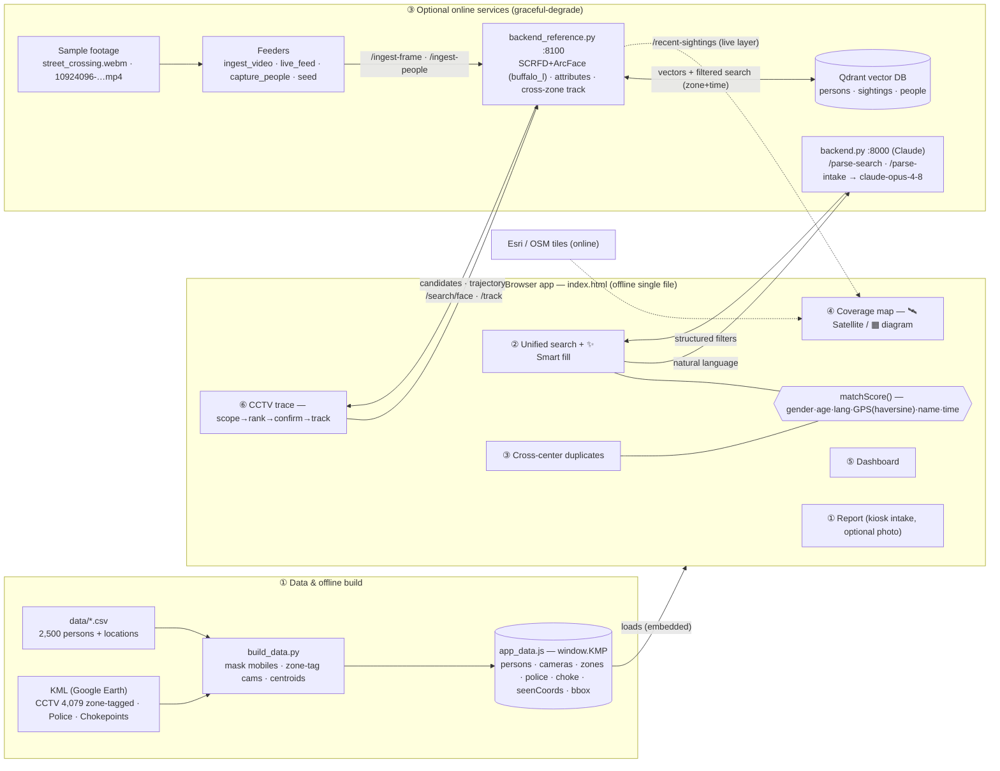

# DRISHTI — App Architecture & Data Flow (as built)

Visual diagram: **`architecture_app.svg`**. Editable flow below.

> This is the *as-built prototype* flow. The aspirational production-scale view
> (edge GPUs / Kafka / Milvus / DeepStream) lives in `architecture_system.svg`
> and `architecture_pipeline.svg`.

## Design principles
- **Offline-first** — Report, Search, Duplicates, Dashboard, and the Diagram map run with **no internet and no backend** (all data embedded in `app_data.js`).
- **Graceful degradation** — Claude NL-search, satellite tiles, and the face/people pipeline activate only when reachable; otherwise the app falls back (diagram map, manual filters, simulated trace).
- **Human-in-the-loop** — every face match is operator-confirmed; the model assists, people decide.
- **Privacy by design** — API key server-side only (never in the browser), consent on uploaded photos, embeddings auto-purged at case/mela close.
- **One-command demo** — `demo_setup.sh` brings the full stack (Qdrant backend + real-time feed + sample data) up at once.

## Request flows (who calls what)
| User action | In-app | Online call | Store |
|---|---|---|---|
| Report / search / duplicates / dashboard | `matchScore()` over `window.KMP` | — | embedded |
| ✨ Smart fill (NL → filters) | Search tab | `backend.py /parse-search` | — |
| Coverage map (satellite + layers + live) | Leaflet ④ | Esri tiles · `/recent-sightings` | Qdrant `sightings` |
| CCTV trace (no-photo locate, Track A) | trace ⑥ | `/search/face` → `/track` | Qdrant `sightings` |
| Live CCTV ingest | — | `live_feed → /ingest-frame` | Qdrant `sightings` |
| Crowd capture + attributes | — | `capture_people → /ingest-people` | Qdrant `people` |
| Enroll missing person | — | `seed → /enroll` | Qdrant `persons` |
